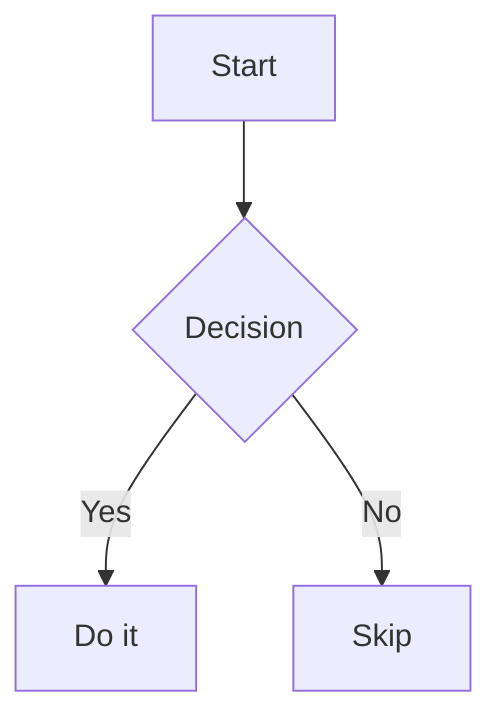

# GLFM Cheatsheet — GitLab-Specific Markdown

This covers features that GitLab Flavored Markdown (GLFM) adds beyond CommonMark and
GitHub Flavored Markdown. Standard Markdown (headings, lists, links, images, code,
emphasis) is assumed knowledge and omitted.

## GitLab-Specific References

These create links that connect issues, MRs, epics, users, labels, and more.

### Core References

| Reference | Description | Cross-project | Shortcut (same namespace) |
|-----------|------------|---------------|---------------------------|
| `#123` | Issue / Epic | `group/project#123` | `project#123` |
| `!456` | Merge request | `group/project!456` | `project!456` |
| `&789` or `[epic:789]` | Epic | `group/subgroup&789` | — |
| `@username` | Mention a user | — | — |
| `@group_name` | Mention a group | — | — |
| `@all` | Mention entire team | — | — |
| `~bug` | Label (one word) | `group/project~bug` | `project~bug` |
| `~"multi word"` | Label (multi-word) | `group/project~"multi word"` | `project~"multi word"` |
| `~"scope::value"` | Scoped label | `group/project~"scope::value"` | `project~"scope::value"` |
| `%v2.0` | Milestone (one word) | `group/project%v2.0` | `project%v2.0` |
| `%"v2.0 release"` | Milestone (multi-word) | `group/project%"v2.0 release"` | `project%"v2.0 release"` |
| `$123` | Snippet | `group/project$123` | `project$123` |
| `9ba12248` | Specific commit | `group/project@9ba12248` | `project@9ba12248` |
| `9ba...b19a` | Commit range | `group/project@9ba...b19a` | `project@9ba...b19a` |
| `[work_item:123]` | Work item | `[work_item:group/project/123]` | `[work_item:project/123]` |
| `[vulnerability:123]` | Vulnerability | `[vulnerability:group/project/123]` | `[vulnerability:project/123]` |
| `[feature_flag:123]` | Feature flag | `[feature_flag:group/project/123]` | `[feature_flag:project/123]` |
| `^alert#123` | Alert | `group/project^alert#123` | `project^alert#123` |
| `[contact:email@example.com]` | CRM contact | — | — |
| `[cadence:123]` | Iteration cadence | — | — |
| `*iteration:"title"` | Iteration | — | — |
| `[[Wiki Page]]` | Wiki page | — | — |
| `[wiki_page:Group:Page]` | Wiki page (explicit) | — | — |

### Issue/MR Linking with Auto-Close

```markdown
Closes #123              # closes issue when MR merges
Fixes #456               # same as Closes
Resolves #789            # same as Closes
Implements #123          # same as Closes
Related to #456          # link without closing
Addresses #789           # link without closing
```

### Show Title and Summary

```markdown
#123+      # renders as: "Issue title (#123)"
!456+      # renders as: "MR title (!456)"
#123+s     # renders with assignee, milestone, health status
```

URL references like `https://gitlab.com/group/project/-/issues/123+` also work.

### Comment Linking

```markdown
https://gitlab.com/group/project/-/issues/123#note_101075757
# Renders as: #123 (comment 101075757)

https://gitlab.com/group/project/-/issues/123/designs
# Renders as: #123 (designs)
```

## Task Lists

Interactive checkboxes in issues, MRs, and comments:

```markdown
- [x] Completed task
- [~] Inapplicable task
- [ ] Incomplete task
  - [x] Sub-task 1
  - [ ] Sub-task 2
```

Numbered task lists also work:
```markdown
1. [x] First
1. [ ] Second
```

Task lists in tables (single checkbox per cell):
```markdown
| Status | Task |
|--------|------|
| [x]    | Done |
| [ ]     | Todo |
```

## Alerts (Callouts)

Blockquotes that render as colored alert boxes:

```markdown
> [!note]
> Useful information users should notice.

> [!tip]
> Optional advice to help users succeed.

> [!important]
> Crucial information needed for success.

> [!warning]
> Critical content demanding immediate attention due to risk.

> [!caution]
> Negative consequences of an action.
```

## Description Lists

```markdown
Term
: Definition
: Another definition

Second term
: Its definition
```

Each term can have multiple definitions. A blank line between term and definition is optional.

## Colors

Hex, RGB, and HSL values render as small color chips:

```markdown
#FF0000
#00FF00
rgb(0,0,255)
hsl(120,100%,50%)
```

Supported formats: `#HEX`, `#HEXHEX`, `#HEXA`, `rgb()`, `rgba()`, `hsl()`, `hsla()`.

## Inline Diffs

Highlight added and removed text:

```markdown
- {+ added text +}
- [- removed text -]
```

Use braces `{}` or brackets `[]`, but don't mix wrapping types. Diff highlighting doesn't
work inside inline code. Escape backticks with `\`` if needed.

## Diagrams

### Mermaid

````markdown

````

Supports: flowchart, sequence diagram, class diagram, state diagram, ER diagram, Gantt
chart, pie chart, mind map, and more. See https://mermaid.js.org/ for syntax.

### PlantUML

Requires admin to enable on self-managed instances. Available on GitLab.com.

````markdown
```plantuml
Bob -> Alice : hello
Alice -> Bob : hi
```
````

`@startuml`/`@enduml` delimiters are not needed inside the `plantuml` block.

### Kroki

Requires admin to enable. Supports many diagram types (BlockDiag, Ditaa, GraphViz, etc.).

## Math (LaTeX / KaTeX)

Inline: `` $`a^2 + b^2 = c^2`$ ``

Block:
````markdown
```math
a^2 + b^2 = c^2
```
````

Also works with `$$...$$`:
```markdown
$$
a^2 + b^2 = c^2
$$
```

KaTeX supports a [subset of LaTeX](https://katex.org/docs/supported.html). GitLab limits
rendering to 50 inline instances; excess renders as plain text.

## Table of Contents

Add to issue, MR, epic, or wiki descriptions (not comments):

```markdown
[[_TOC_]]
```

Or:
```markdown
[TOC]
```

Auto-generates an unordered list of links to every heading in the document.

## Emoji

```markdown
:smile:  :thumbsup:  :rocket:  :warning:  :tada:
```

Standard shortcodes. Custom emoji are also supported on GitLab.com.

## Footnotes

```markdown
Some text with a footnote.[^1]

[^1]: The footnote content appears at the bottom.
```

## Front Matter

YAML front matter at the top of Markdown files:

```markdown
---
stage: Plan
group: Knowledge
---
```

Rendered in a styled box on wiki pages and repository files.

## Collapsible Sections

Use HTML `<details>` tags:

```html
<details>
<summary>Click to expand</summary>

Content that is hidden until expanded. Supports full GLFM inside.

- List items
- `code`
- **bold**

</details>
```

## Multiline Blockquotes

Fenced with `>>>`:

```markdown
>>>
Multiple lines
of quoted text
without prefixing each line
>>>
```

## JSON Tables

Render tabular data from JSON code blocks:

````markdown
```json:table
{
    "fields": [
        {"key": "name", "label": "Name", "sortable": true},
        {"key": "value", "label": "Value"}
    ],
    "items": [
        {"name": "CPU", "value": "45%"},
        {"name": "Memory", "value": "12GB"}
    ],
    "filter": true,
    "caption": "System Metrics"
}
```
````

Options: `fields` (with optional `label`, `sortable`), `items`, `filter` (boolean),
`markdown` (boolean, for GLFM in cell values), `caption`.

## Embedded Video and Audio

Video (`.mp4`, `.m4v`, `.mov`, `.webm`, `.ogv`):
```markdown

```

Audio (`.mp3`, `.oga`, `.ogg`, `.spx`, `.wav`):
```markdown

```

## Image/Video Dimensions

```markdown
{width=300 height=200px}
{width=75%}
```

## Places GLFM is Supported

- Issue & MR descriptions and comments
- Epic descriptions and comments
- Wiki pages
- Milestone descriptions
- Snippets (`.md` extension)
- Releases
- Repository Markdown files

**Titles** (issue, MR, epic) have limited support: only emoji, auto-linked URLs, and
GitLab-specific references. Bold, italic, code, links, and other formatting are **not**
processed in titles.
